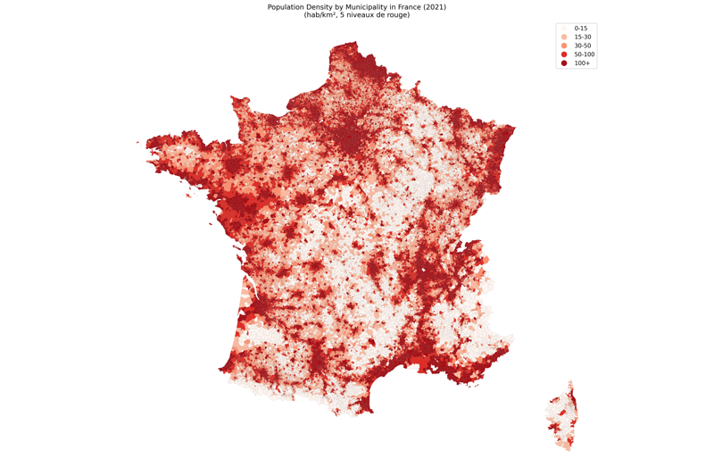
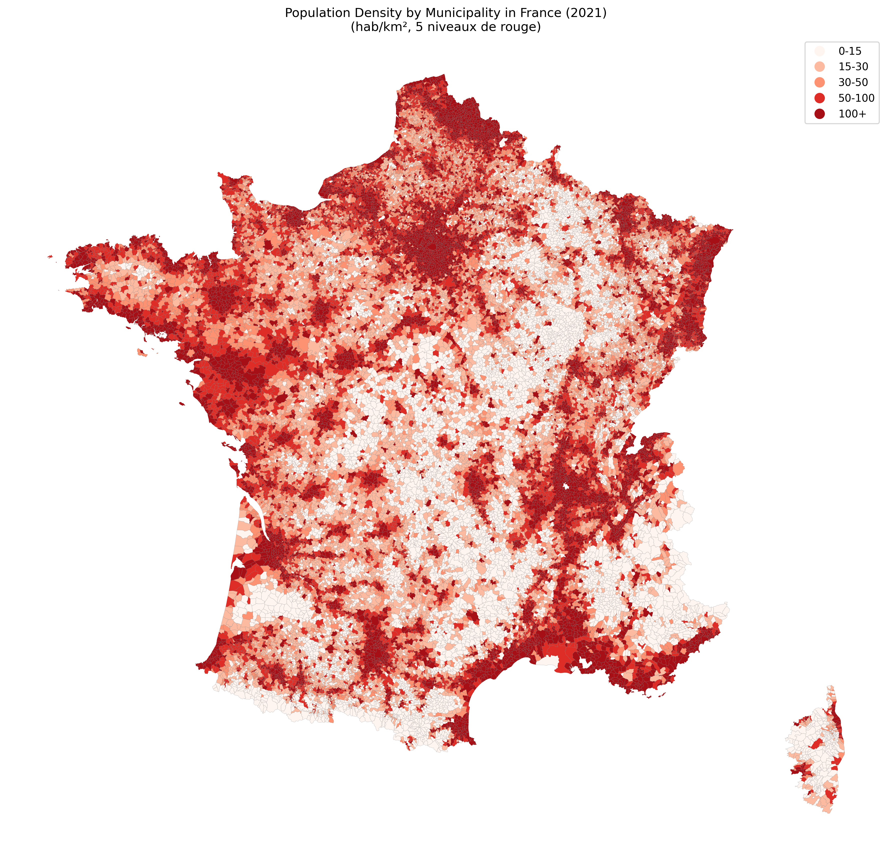

# MapGenerator


**MapGenerator** is a professional Python tool to generate and export a map of France showing population densities by municipality (commune), using official INSEE and administrative boundaries data.

## Features
- Reads French municipality boundaries (GeoJSON) and population data (Excel, INSEE format)
- Handles Paris as a single commune by aggregating arrondissement data if needed
- Computes population density (inhabitants/km²) for each municipality
- Classifies density into 5 custom bins: 0–15, 15–30, 30–50, 50–100, 100+ hab/km²
- Visualizes the map with a professional 5-level red color scale
- Exports the map as a high-resolution PNG with a timestamped filename

## Requirements

Install dependencies with:

```bash
pip install -r requirements.txt
```


## Example Output

Below is an example of the generated map:



## Usage

1. Download the following datasets and place them in the project root:
	- `communes.json` (GeoJSON of French municipalities, e.g. from [data.gouv.fr](https://www.data.gouv.fr/fr/datasets/contours-des-communes-de-france/))
	- `POPULATION_MUNICIPALE_COMMUNES_FRANCE.xlsx` (INSEE population by commune, e.g. from [insee.fr](https://www.insee.fr/fr/statistiques/6011076))

2. Run the main script:

```bash
python main.py
```

The map will be displayed and automatically exported as a PNG file (e.g. `france_density_map_YYYYMMDD_HHMMSS.png`).

## Project Structure

- `main.py` — Minimal entry point
- `map_generator.py` — All core logic, modular and PEP-8 compliant
- `requirements.txt` — Python dependencies

## Customization

- You can adjust the density bins or color palette in `map_generator.py`.
- The export filename is timestamped for easy versioning.

## License

MIT License
